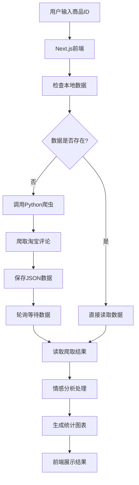

# 课程设计项目 - 电商评论情感分析系统

## 项目概述

这是一个基于Web的电商评论情感分析系统，通过爬取淘宝/天猫商品评论数据，进行情感分析和可视化展示。系统由三个核心模块组成，实现了从数据采集到分析展示的完整流程。

## 项目结构

```
course_design/
├── pachong/              # Python爬虫模块
├── my-next-app/          # Next.js前端应用
├── curl-parser/          # cURL解析工具
└── output/               # 数据输出目录
```

## 各模块说明

### 1. pachong/ - 数据爬取模块

**作用**: 负责从淘宝/天猫网站爬取商品评论数据

**技术栈**:
- Python 3.9+
- requests (HTTP请求)
- json (数据格式处理)
- time (时间戳生成)

**主要功能**:
- 模拟浏览器请求获取评论数据
- 支持多页评论爬取
- 自动处理反爬虫机制
- 数据清洗和格式化
- JSON格式数据存储

**核心文件**:
- `spider.py` - 主爬虫脚本
- `requirements.txt` - Python依赖
- `output/` - 爬取数据存储目录

### 2. my-next-app/ - 前端分析应用

**作用**: 提供用户界面，展示评论数据并进行情感分析

**技术栈**:
- Next.js 14 (React框架)
- TypeScript (类型安全)
- Tailwind CSS (样式框架)
- Chart.js (数据可视化)
- Node.js (后端API)

**主要功能**:
- 商品ID输入和搜索
- 评论数据可视化展示
- 情感分析结果展示
- 统计图表生成
- 自动数据爬取触发

**核心文件**:
- `app/page.tsx` - 主页面
- `app/components/CommentAnalytics.tsx` - 评论分析组件
- `app/api/crawl/route.ts` - 爬虫API接口
- `app/api/sentiment/route.ts` - 情感分析API

### 3. curl-parser/ - cURL解析工具

**作用**: 解析cURL命令，提取请求参数和cookies

**技术栈**:
- Next.js 14
- TypeScript
- 正则表达式解析

**主要功能**:
- 解析cURL命令字符串
- 提取URL、Headers、Cookies等参数
- 生成可复用的请求配置
- 辅助爬虫参数更新

## 系统工作流程



## 技术特点

### 1. 自动化数据获取
- 前端输入商品ID后自动触发爬虫
- 轮询机制确保数据完整性
- 智能缓存避免重复爬取

### 2. 实时情感分析
- 基于规则的情感分析算法
- 支持正面、负面、中性分类
- 实时统计和可视化

### 3. 响应式设计
- 移动端友好的界面设计
- 现代化的UI组件
- 流畅的用户体验

### 4. 数据可视化
- 情感分布饼图
- 评分分布柱状图
- 评论时间趋势图

## 安装和运行

### 环境要求
- Node.js 18+
- Python 3.9+
- pnpm (推荐) 或 npm

### 1. 安装Python依赖
```bash
cd pachong
pip install -r requirements.txt
```

### 2. 安装Next.js依赖
```bash
cd my-next-app
pnpm install
```

### 3. 安装cURL解析器依赖
```bash
cd curl-parser
pnpm install
```

### 4. 启动服务
```bash
# 启动Next.js应用 (端口3002)
cd my-next-app
pnpm dev

# 启动cURL解析器 (端口3001)
cd curl-parser
pnpm dev
```

## 使用说明

1. **访问应用**: 打开 http://localhost:3002
2. **输入商品ID**: 在输入框中输入淘宝商品ID
3. **自动分析**: 系统会自动爬取数据并进行情感分析
4. **查看结果**: 浏览评论统计和可视化图表

## 项目特色

- **全自动化**: 无需手动操作，输入ID即可获取完整分析
- **实时更新**: 支持实时爬取最新评论数据
- **智能缓存**: 避免重复爬取，提高效率
- **可视化展示**: 直观的图表和统计信息
- **模块化设计**: 各模块独立，易于维护和扩展

## 注意事项

- 请遵守网站爬虫协议，合理使用爬虫功能
- 建议在测试环境中使用，避免对目标网站造成压力
- 定期更新cookies以确保爬虫正常工作

## 开发团队

本项目为课程设计作业，展示了现代Web开发中前后端分离、数据爬取、情感分析等技术的综合应用。
